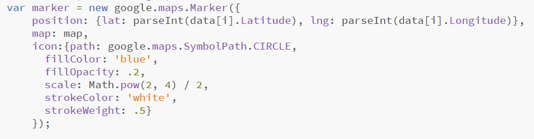

# Wrote in Jan 2020 for BCIT Hackathon.
<!-- wp:paragraph -->

This weekend we went to QDS Hackathon about data analysis. We decided to collect data from public database and plot them on the map. We chose Google Maps as our platform. 

<!-- /wp:paragraph -->

<!-- wp:paragraph -->

The APIs for Google Maps are extensive, but the service actually costs money. 

<!-- /wp:paragraph -->

<!-- wp:paragraph -->

In Google Maps, it uses the coordinates to identify a certain location. That is, we need latitude and longitude to spot a marker on the map. One challenge for us is to convert the data from address to coordinates. Since Google services can actually cost money, one of the challenges for us was to find a way that saves money. 

<!-- /wp:paragraph -->

<!-- wp:paragraph -->

*Google services give $300 of free credits. Geocode gives $200 of free credits. 

<!-- /wp:paragraph -->

<!-- wp:paragraph -->

<strong>Geocoding</strong>

<!-- /wp:paragraph -->

<!-- wp:paragraph -->

results[0].geometry.location this is a string returning (xxx.xxxx, xxx,xxxx). If you want the floating numbers, you need to parse it into two substrings and parseFloat the two substrings. 

<!-- /wp:paragraph -->

<!-- wp:paragraph -->

<strong>Shapes: circles</strong>

<!-- /wp:paragraph -->

<!-- wp:paragraph -->

center: {lat: parseFloat((results[0].geometry.location).toString().substring(1,11)),lng:parseFloat((results[0].geometry.location).toString().substring(12,25))}

<!-- /wp:paragraph -->

<!-- wp:paragraph -->

If you are trying to get the coordinates from geocoding, you need to process the data using the method mentioned above. 

<!-- /wp:paragraph -->

<!-- wp:paragraph -->

<strong>Shapes: rectangles</strong>

<!-- /wp:paragraph -->

<!-- wp:paragraph -->

This uses bounds. 

<!-- /wp:paragraph -->

<!-- wp:paragraph -->

<strong>Customize markers</strong>

<!-- /wp:paragraph -->

<!-- wp:paragraph -->

You can add attributes to the marker icons. You can also add customized icons.

<!-- /wp:paragraph -->

---
Link to the project: [click me](https://qds20team16.web.app/).

---
v.1 2020.1  

v.2 2020.7  

v.3 2020.8

v.4 2020.8 --fixed the image links + author name  

v.5 2020.9 -- grammar fixes